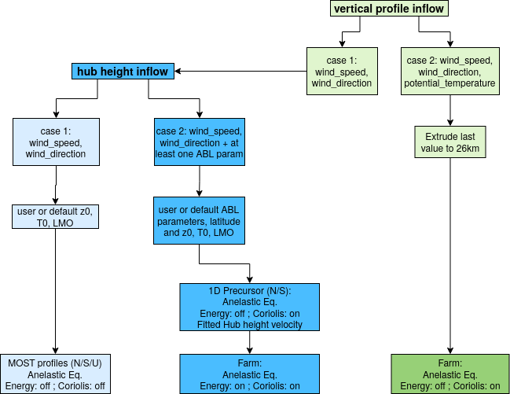
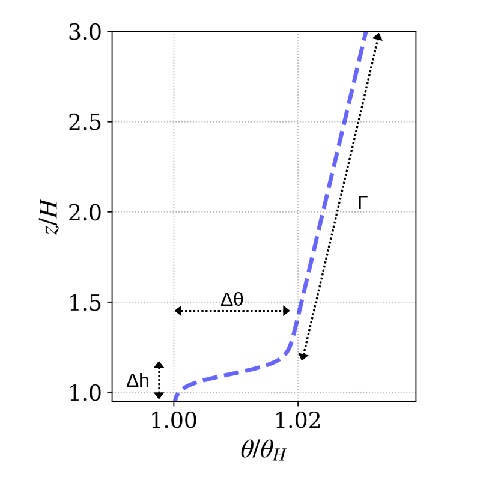

Inflow Boundary Conditions
--------------------------
Inflow refers to the meteorological profiles provided as boundary and initial conditions for the wind farm simulation. It consists of velocity (components :math:`u` and :math:`v`), temperature, turbulent kinetic energy :math:`k` and dissipation rate of turbulent kinetic energy :math:`\varepsilon` profiles. Inflow conditions are determined by the data given as an input.

.. warning::
   Considering the impact of the methodology used to generate inflow profiles on the model results, the user should be carefull about input data and parameters

A summary of the inflow profile methodology is summarized in the following figure (more details are given in the next sections).

   Schematic representation of the choice of inflow method as a function of input parameters

Input data at hub height or at a reference altitude
+++++++++++++++++++++++++++++++++++++++++++++++++++

If input data contains only values at hub height or at a reference height (absence of ``heights`` dimension in input data), synthetic meteorological profiles are constructed. In the case of minimal input data available, namely ``wind_speed`` and ``wind_direction``, default values for roughness ``z0``, Monin-Obukhov length ``LMO`` and ground temperature ``T0`` are chosen. Default values are shown below.

+------------+-----------------+
| Variable   | Default value   |
+============+=================+
| ``z0``     | :math:`0.0001`  |
+------------+-----------------+
| ``LMO``    | :math:`\infty`  |
+------------+-----------------+
| ``T0``     | :math:`293.15K` |
+------------+-----------------+

In that case, profiles from Monin-Obukhov similarity theory matching the ``wind_speed`` value at hub height are prescribed in a :math:`800m` high numerical domain with an angle corresponding to the ``wind_direction``, the enrgy equation is turned off and coriolis force is not accounted for. If input data contains ``z0``, ``LMO`` or ``T0``, default values are replaced by input data.

If input data contains at least one variable describing the upper boundary layer and free atmosphere (``ABL_height``, ``capping_inversion_thickness``, ``capping_inversion_strength``, or ``lapse_rate``), the temperature profile above the boundary layer height is constructed based on the parameters provided according to the following figure.

   Potential temperature profile above the boundary layer height :math:`H` (``ABL_height``) with :math:`\Delta h` corresponding to ``capping_inversion_thickness``, :math:`\Delta \theta` to ``capping_inversion_strength`` and :math:`\Gamma` to ``lapse_rate``.

If some of the parameters are not present, default values shown below are used to construct the profile.

+---------------------------------+-----------------+
| Variable                        | Default value   |
+=================================+=================+
| ``ABL_height``                  | :math:`1500m`   |
+---------------------------------+-----------------+
| ``capping_inversion_thickness`` | :math:`300m`    |
+---------------------------------+-----------------+
| ``capping_inversion_strength``  | :math:`2K`      |
+---------------------------------+-----------------+
| ``lapse_rate``                  | :math:`1K/km`   |
+---------------------------------+-----------------+

Below the boundary layer height, depending on the Monin-Obukhov length ``LMO``, potential temperature is constant for neutral boundary layer (either no ``LMO`` in input data or ``LMO`` superior to :math:`1000m`) or calculated using a blending between Monin-Obukhov similarity theory in the surface layer and Nieuwstadt (1984) :cite:`nieuwstadt1984` theory toward the top of the boundary layer for positive ``LMO`` lower than :math:`1000m`. Negative ``LMO`` corresponding to unstable atmospheric conditions are not supported with this methodology.

For all the cases with capping inversion, a precursor simulation consisting in a 1D bi-periodic :math:`26km` high column model is run prior to the wind farm simulation in order to have converged profiles that will be maintained in the wind farm numerical domain. This ensure to better control the incoming flow upstream of the farm. In the precursor simulation, Coriolis force is included with a forcing on the constant geostrophic wind speed above the boundary atmospheric layer height and energy equation is turned off. Wind speed and turbulent quantity profiles adapt to the imposed temperature.

For neutral atmospheric condtitions, the column model is initialized with constant velocity, TKE and dissipation rate of TKE profiles. An iterative method is implemented to let the profile converged and match the target velocity at the reference height from the input data.

For stable atmospheric conditions, the column model is initialized with velocity, TKE and dissipation rate of TKE profiles from the same theoretical framework used to build the temperature profile (blending between Monin-Obukhov similarity theory in the surface layer and Nieuwstadt (1984) :cite:`nieuwstadt1984` theory toward the top of the boundary layer).

Once converged, the profiles issued from the precursor simulation are given as boundary conditions for the wind farm simulation. In that case, the numerical domain is :math:`25km` high. Damping layers are implemented toward the top and lateral boundaries of the numerical domain to absorb gravity waves generated by the interaction between the wind farm and the stratified atmosphere. Energy equation and Coriolis force are turned on.

Vertical profiles as input data
++++++++++++++++++++++++++++++

Vertical profiles are given as input data if the ``heights`` dimension is present in the input data. If the ``potential_temperature`` variable is present in input data, vertical profiles are extruded to reach :math:`26km` and directly imposed as boundary conditions for the wind farm simulation with energy equation turned off and Coriolis force included.

If the ``potential_temperature`` variable is not present in the input data, ``wind_speed`` and ``wind_direction`` are interpolated at hub height and inflow data follows the process from the previous section to generate the inflow.
